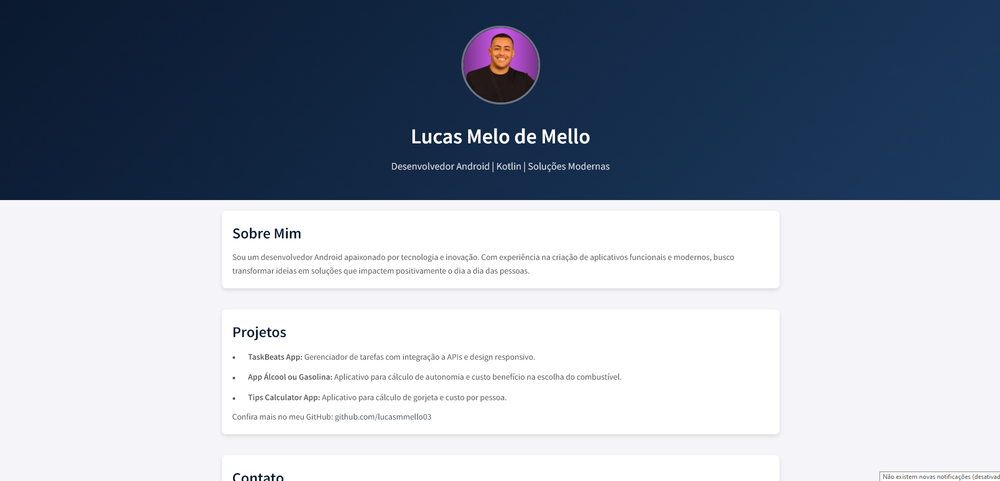

# Portfólio de Lucas Melo de Mello

Bem-vindo ao repositório do meu site de portfólio! Este projeto foi criado para apresentar minhas habilidades, projetos e formas de contato de forma profissional e moderna.

## 🚀 Tecnologias Utilizadas

- **HTML5**: Para a estruturação do conteúdo.
- **CSS3**: Para estilização e design responsivo.
- **JavaScript**: Para interatividade e funcionalidade dinâmica.
- **GitHub Pages**: Para hospedar e disponibilizar o site na web.

## 🎨 Estrutura do Projeto

Abaixo está a organização dos arquivos e pastas:

```plaintext
/
├── index.html          # Arquivo principal do site
├── styles.css          # Estilos do site
├── script.js           # Scripts para funcionalidades dinâmicas
└── assets/             # Imagens e outros recursos estáticos
```

## 🌟 Funcionalidades

- **Design Responsivo**: Totalmente otimizado para diferentes tamanhos de tela, incluindo dispositivos móveis.
- **Projetos Recentes**: Uma lista com meus principais projetos e links para o GitHub.
- **Contato Direto**: Links para meu e-mail e LinkedIn.

## 📷 Prévia do Site

Confira como está o visual do portfólio:

 <!-- Substitua pelo link de uma imagem real se possível -->

## 🌐 Acesse o Site

O site está no ar e pode ser acessado pelo seguinte link:
[Lucas Melo de Mello | Desenvolvedor Android](https://lucasmmello03.github.io/) <!-- Substitua pelo link correto do GitHub Pages -->

## 🛠️ Como Executar Localmente

Se quiser rodar o projeto em sua máquina local:

1. Clone este repositório:
   ```bash
   git clone https://github.com/seu-usuario/nome-do-repositorio.git
   ```
2. Navegue até a pasta do projeto:
   ```bash
   cd nome-do-repositorio
   ```
3. Abra o arquivo `index.html` em seu navegador.

## 📝 Licença

Este projeto está sob a licença MIT. Sinta-se à vontade para utilizá-lo e adaptá-lo conforme necessário.

## 📩 Contato

Se tiver dúvidas ou quiser entrar em contato comigo, envie um e-mail para: [lucasmmello03@gmail.com](mailto:lucasmmello03@gmail.com).

Conecte-se também pelo [LinkedIn](https://www.linkedin.com/in/mellolucas03/) ou veja mais no meu [GitHub](https://github.com/lucasmmello03).

---

⭐ Se você gostou deste projeto, não se esqueça de dar uma estrela no repositório!
